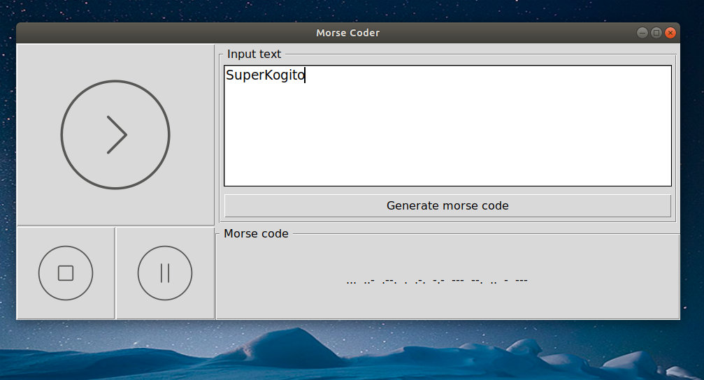
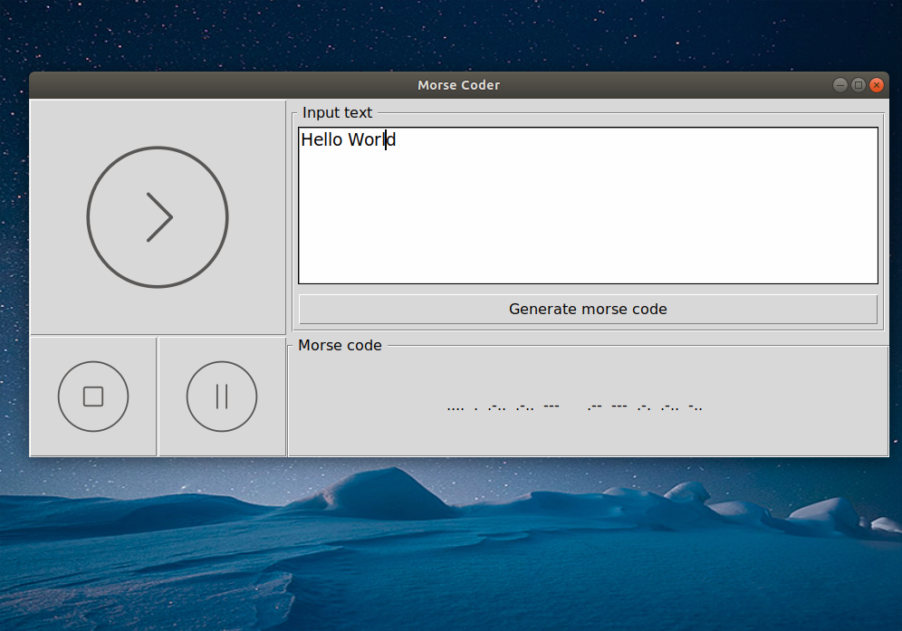

# Morse-coder
This is a morse code generator written in python 3. It is based on the tkinter library and includes a simple gui and a code player functionality. The code simply reads a text (no special characters/ just letters) and it iterates through it word by word to generate its respective Morse code and an mp3 sample of the genereated code.

These instructions will get you a copy of the project up and running on your local machine for development and testing purposes.

### Prerequisites

In order to excute this code you will need the following python 3 packages:
* tkinter package
```
sudo apt-get install python3-tk
```
* pygame package (used for the pygame.mixer to play the mp3 sample)
```
pip install pygame
```
* pydub (used to generate the mp3 sample)
```
pip3 install pydub
```
## Tests

This code has been only tested on ubuntu 16.04

## Deployment
Navigate to folder and extract mp3_samples.tar.xz file. This will result in a folder with all the mp3 samples used by the code. Then you can run this code either by using a python IDE or by running the following command in the terminal:
```
python3 main.py
```
## Screenshots



## Built With
* [Spyder3](http://pythonhosted.org/spyder/)

## Contributing
If you have any improvement's suggestions, please contact me.

## License

This project is licensed under the MIT License - see the [LICENSE.md](LICENSE.md) file for details

## Acknowledgments and ressources

* The nameless heros of Stackoverflow
* Mp3 processing: [pydub](http://pydub.com/)
* Mp3 player: [pygame](https://www.pygame.org/news)
* Icons: [iconfinder](https://www.iconfinder.com/)
* mp3-samples: [morsecodealphabet](http://morsecodealphabet.org/morse-code-alphabet-mp3.html)
